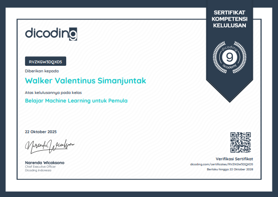

<!-- PROJECT LOGO -->
<br />
<div align="center">
  
  <h2 align="center">Membangun Proyek Machine Learning - Dicoding</h2>

  <p align="center">
    Walker Valentinus Simanjuntak
  </p>
</div>


<!-- TABLE OF CONTENTS -->
<details>
  <summary>Table of Contents</summary>
  <ol>
    <li>
      <a href="#about-the-project">About The Project</a>
      <ul>
        <li><a href="#built-with">Built With</a></li>
      </ul>
    </li>
    <li>
      <a href="#getting-started">Getting Started</a>
      <ul>
        <li><a href="#prerequisites">Prerequisites</a></li>
        <li><a href="#installation">Installation</a></li>
      </ul>
    </li>
    <li><a href="#usage">Usage</a></li>
    <li><a href="#roadmap">Roadmap</a></li>
    <li><a href="#contact">Contact</a></li>
  </ol>
</details>


<!-- ABOUT THE PROJECT -->
## About The Project

Proyek ini bertujuan untuk menganalisis data transaksi dan mengidentifikasi potensi penipuan (fraud) melalui pendekatan unsupervised learning. Alur kerja utamanya adalah menggunakan K-Means Clustering untuk mengelompokkan data ke dalam beberapa "profil perilaku normal".
Untuk meningkatkan performa clustering dan mengatasi curse of dimensionality, Principal Component Analysis (PCA) diterapkan terlebih dahulu untuk mereduksi dimensi data.
Setelah cluster (profil) terbentuk, anomali atau potensi fraud diidentifikasi sebagai titik data yang memiliki jarak terjauh dari centroid cluster masing-masing.
Sebagai langkah validasi, beberapa model klasifikasi supervised (seperti Random Forest, KNN, dan Logistic Regression) dilatih untuk memprediksi cluster yang dihasilkan K-Means. Hasil akurasi 100% dari model-model ini mengkonfirmasi bahwa cluster yang terbentuk sangat jelas, stabil, dan terdefinisi dengan baik.


### Built With

Proyek ini dibangun terutama menggunakan ekosistem Python untuk Data Science.
+ Python
+ Pandas
+ NumPy
+ Scikit-learn
+ Matplotlib
+ Joblib
+ Jupyter Notebook


<!-- GETTING STARTED -->
## Getting Started

Untuk menjalankan salinan lokal proyek ini, ikuti langkah-langkah sederhana berikut.

### Prerequisites

Pastikan Anda memiliki conda/anaconda dan pip terinstal di sistem Anda. Anda dapat menginstal semua dependency yang diperlukan menggunakan file requirements.txt.

### Installation

Untuk menjalankan salinan lokal proyek ini, ikuti langkah-langkah sederhana berikut.

1. Clone the repo
   ```sh
   git clone https://github.com/bluga404/ml-project-dicoding.git
   ```
2. Pindah ke direktori proyek
   ```sh
   cd /ml-project-dicoding
   ```
4. Buat conda environment
   ```sh
   conda create --name <env> --file requirements.txt
   conda activate <env>
   ```


<!-- USAGE EXAMPLES -->
## Usage

Proyek ini disajikan dalam format Jupyter Notebook. Cukup buka file notebook dan jalankan sel-selnya secara berurutan.


<!-- ROADMAP -->
## Roadmap

+ Preprocessing data (Scaling & Encoding).
+ Implementasi K-Means Clustering dengan PCA.
+ Analisis dan interpretasi profil cluster.
+ Identifikasi anomali berdasarkan jarak ke centroid.
+ Validasi cluster menggunakan model klasifikasi supervised.
+ Penyimpanan model yang telah dilatih.


<!-- CONTACT -->
## Contact

Walker Valentinus Simanjuntak - <a href="mailto:walkervalentinussimanjuntak@gmail.com" class="btn hire-btn">Email</a>

Linkedin: <a href="https://www.linkedin.com/in/walkersimanjuntak/">Linkedin</a>